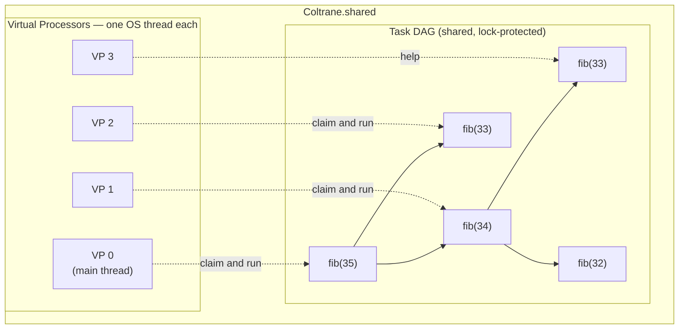
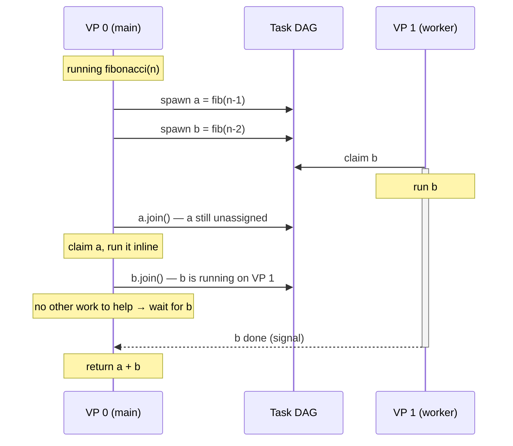

# Coltrane

A Swift runtime that builds on the ideas of **Anahy**, the multithreaded scheduling model described in [*Exploiting Multithreaded Programming on Cluster Architectures*](https://ieeexplore.ieee.org/abstract/document/1430058/) (HPCS 2005) and in [*Anahy: A Programming Environment for Cluster Computing*](https://link.springer.com/chapter/10.1007/978-3-540-71351-7_16) (VECPAR 2006): a library for describing application *concurrency* (logical threads and data dependencies) and letting a runtime schedule it onto the *parallelism* the hardware provides (real threads pinned to cores). Single-machine, multi-core. The cluster layer of the original model is out of scope.

You write `spawn`/`join` and never reason about cores or thread pools. The runtime builds a [**DAG**](https://en.wikipedia.org/wiki/Directed_acyclic_graph) of tasks implicitly from the nesting of `spawn` calls and schedules it onto a fixed pool of **Virtual Processors**, each a real OS thread with the pool sized to the core count by default, using **work-helping**: an idle or joining VP executes pending descendant tasks itself rather than blocking.

In other words, you focus on describing the concurrency of your application instead of having to worry about the parallelism your hardware supports or allows.

> This is a deliberate alternative to Swift Structured Concurrency. The core is built on raw threads and locks (`Thread`, `NSCondition`, `NSRecursiveLock`, `DispatchSemaphore`). There is no `async`/`await`, no actors, and no stack switching. Jobs run inline on a VP's real call stack.

## Installation

Coltrane is a Swift package (Swift 6, macOS 13+). Add it to your `Package.swift`:

```swift
let package = Package(
    name: "MyApp",
    dependencies: [
        .package(url: "https://github.com/otaviocc/Coltrane.git", from: "1.1.0")
    ],
    targets: [
        .target(
            name: "MyApp",
            dependencies: ["Coltrane"]
        )
    ]
)
```

In Xcode: **File ▸ Add Package Dependencies…**, paste `https://github.com/otaviocc/Coltrane.git`, and add the `Coltrane` library product to your target.

Then `import Coltrane` wherever you use it.

## Example

```swift
import Coltrane

func fibonacci(_ n: Int) -> Int {
    guard n > 1 else { return n }
    if n <= 20 { return fibonacci(n - 1) + fibonacci(n - 2) } // sequential cutoff
    let a = Coltrane.shared.spawn { fibonacci(n - 1) }
    let b = Coltrane.shared.spawn { fibonacci(n - 2) }
    return a.join() + b.join()
}

Coltrane.shared.initialize(maxVPs: 4)
print(Coltrane.shared.spawn { fibonacci(35) }.join())
Coltrane.shared.terminate()
```

Below the cutoff, the function recurses directly instead of spawning. A task that small costs more to schedule than to compute, so splitting only pays off for the coarser upper levels of the tree. Tune the threshold to the work per task. This is not specific to Coltrane. Every task runtime (including `async`/`await`) needs a cutoff for fine-grained recursion.

The core invariant: the result is **independent of the VP count**. `fibonacci(35)` is `9227465` on 1, 2, 4, or 8 VPs.

## Usage

**1. Start and stop the runtime.** Call `initialize(maxVPs:)` once before spawning any work and `terminate()` when you are done. The thread that calls `initialize` becomes VP 0; the rest are spun up as worker threads. Omit `maxVPs` to size the pool to the core count. `terminate()` returns the number of jobs that were spawned but never joined — `0` for a well-behaved program, so it doubles as a leak check.

```swift
Coltrane.shared.initialize()          // one VP per core
defer { Coltrane.shared.terminate() }
```

**2. Spawn work, join the result.** `spawn` adds a task to the graph and hands back a `JobHandle<T>`. The closure does **not** run eagerly — it runs when some VP claims it (including the VP that joins it). Call `join()` to get the result; while it waits, the joining VP helps run other pending work instead of blocking. Use `fetch()` instead when you want the result but do not want the caller to pitch in (e.g. from a thread that is not a VP).

```swift
let a = Coltrane.shared.spawn { expensive(0) }
let b = Coltrane.shared.spawn { expensive(1) }
let total = a.join() + b.join()       // both run in parallel, result is deterministic
```

Closures run on arbitrary VPs, so anything they capture and mutate must be safe to touch from multiple threads. The cleanest style is the functional one above: each task returns a value and the parent combines results after joining, rather than writing into shared state.

**3. Add a sequential cutoff for fine-grained recursion.** Below some size, recurse directly instead of spawning — a task too small to schedule costs more than it saves (see the `n <= 20` guard in the example above). Every task runtime needs this; tune the threshold to the work per task.

**4. Fan out data-parallel work with `spawnSplit`.** For flat "split a range, process the pieces, merge" workloads, `spawnSplit` does the spawning and joining for you:

```swift
let sum = Coltrane.shared.spawnSplit(
    data: 0..<1_000_000,
    splitFactor: 8,
    split: { range, parts, i in chunk(range, parts, i) },  // input for piece i
    merge: { partials in partials.reduce(0, +) }           // combine results
) { chunk in
    chunk.reduce(0, +)                                     // process one piece
}.join()
```

**5. Tune options when needed.** Pass `JobOptions` to `spawn` for per-task control: `maxJoins` (how many times a job may be joined before it is removed from the graph, default `1`), `detachState` (`.joinable` vs `.detached` fire-and-forget), and `affinity` (`.any` or `.specific(vpID)` to pin a task to one VP). Set `Coltrane.shared.helpingStrategy` to match the workload shape:

- `.joinedSubtree` (default) — a joining VP only helps within the joined job's subtree. Safe for deep recursive fork/join: it bounds how much helped work can grow the joining thread's call stack.
- `.anywhere` — a joining VP can help with any pending job. Best for flat, data-parallel fan-out (Mandelbrot rows, an N-body force pass). Avoid it on deep recursive workloads, where it can deepen the stack beyond the program's own recursion.
- `.currentSubtree` — help within the subtree of the job currently running on this VP.

## How it works

The runtime holds a fixed pool of Virtual Processors (real OS threads) that share one task DAG. `spawn` adds a node to the graph; any idle VP — or a VP that is currently joining — claims a pending node and runs it, so work flows to whichever thread is free.



A joining VP never blocks while there is work to do: joining a task that another VP is already running, it helps by running other pending tasks, and only parks (briefly) once the subtree is fully in flight elsewhere. Here is a two-VP run of `a.join() + b.join()` from inside one `fibonacci` call:



## API

- `Coltrane.shared.initialize(maxVPs:)` / `terminate()`: start and stop the runtime. The calling thread becomes VP 0.
- `spawn(options:_:) -> JobHandle<T>`: create a task, returning a handle to its eventual result.
- `JobHandle<T>.join() -> T`: wait for the result, helping run pending work in the meantime.
- `JobHandle<T>.fetch() -> T`: wait for the result without contributing work.
- `JobHandle<T>.isComplete`: whether the result is ready.
- `spawnSplit(data:splitFactor:split:merge:_:)`: fan a value into sub-tasks and merge their results.
- `JobOptions`: per-task options: `maxJoins`, `detachState`, and `affinity` (`ProcessorAffinity`).
- `Coltrane.shared.helpingStrategy`: `.anywhere` / `.currentSubtree` / `.joinedSubtree` (default): where a joining VP looks for work to help with.

## Build and Test

```sh
swift build
swift test
```

## Demos

Each demo computes the same result three ways: plain recursion/loops, Coltrane `spawn`/`join`, and Swift `async`/`await`. It times them and asserts they agree (async/await appears only in the demos. The core library has none). Use a release build for meaningful timings.

### FiboDemo

```sh
swift run -c release FiboDemo
swift run -c release FiboDemo 38 8 30
```

Recursive Fibonacci: deep, fine-grained fork/join, using the default `joinedSubtree` helping policy. Arguments: `[n] [maxVPs] [cutoff]`. Scales roughly 6x on 8 VPs.

### MandelbrotDemo

```sh
swift run -c release MandelbrotDemo
swift run -c release MandelbrotDemo 1500 12 1000
```

The Mandelbrot set, one job per image row: flat, coarse data-parallelism. Sets `helpingStrategy = .anywhere` so a joining VP can help with any pending row. Writes a viewable `mandelbrot.pgm`. Arguments: `[size] [maxVPs] [maxIter]`. Scales roughly 5x on 8 VPs.

### NBodyDemo

```sh
swift run -c release NBodyDemo
swift run -c release NBodyDemo 100000 12 30
```

Gravitational N-body with a Barnes–Hut quadtree: a sequential tree build, then a lock-free per-body force evaluation (chunked, `.anywhere` policy) that is bit-identical across all three methods. The tree is a flat array of value-type cells traversed via `UnsafeBufferPointer` (not a graph of class nodes, which would cap scaling with ARC traffic on shared objects). Writes an `nbody.pgm` density image. Arguments: `[bodies] [maxVPs] [steps]`. Scales roughly 7x on 8 VPs.

### NBody3DDemo

```sh
swift run -c release NBody3DDemo
swift run -c release NBody3DDemo 100000 12 30
swift run -c release NBody3DDemo 100000 12 8000 --save --stride=8
```

The 3D sibling of NBodyDemo: the same chunked, lock-free, bit-identical force evaluation, but over an **octree** (eight children per cell) instead of a quadtree, with bodies carrying a `z` position and velocity. The scene is a galaxy-style collision: two filled, rotating star clusters on a grazing trajectory (offset by an impact parameter, internal spins aligned with the orbit) merge into a rotating, flattened remnant with tidal tails. Cluster mass is fixed independent of particle count, so `[bodies]` controls only resolution/smoothness, not the dynamics. Same parallel structure and `.anywhere` policy. Arguments: `[bodies] [maxVPs] [steps] [--save] [--stride=K]`. The scene constants (`clusterMass`, `impactParameter`, `approachSpeed`, `spinFraction`, `dispersionFraction`, softening, `dt`) are at the top of `main.swift`.

It renders two views: a top-down `nbody3d.pgm` (xy projection) and a tilted-camera `nbody3d_tilted.pgm` that depth-shades each body by its distance to the camera, so the structure reads as 3D rather than as a flat disk.

Pass `--save` to write one PGM frame into `./output/top` and `./output/tilted` as zero-padded sequences (`frame_00000.pgm`, `frame_00001.pgm`, …); `--stride=K` saves every Kth step (handy for long runs). Either view can then be turned into an animation:

```sh
ffmpeg -framerate 30 -i output/tilted/frame_%05d.pgm -pix_fmt yuv420p nbody3d_tilted.mp4   # mp4
ffmpeg -framerate 30 -i output/tilted/frame_%05d.pgm nbody3d_tilted.gif                    # gif
```

## Benchmarks

Measured on a MacBook Pro (Apple M4 Pro, 12 cores, 48 GB), release build, best of 5 runs, in milliseconds. The **1–12 VP** columns are Coltrane on that many Virtual Processors. The N-body rows time the parallel force evaluation only (the sequential tree build is shared by all three and excluded).

| Workload | Sequential | async/await | 1 VP | 2 VP | 4 VP | 6 VP | 8 VP | 10 VP | 12 VP |
|---|--:|--:|--:|--:|--:|--:|--:|--:|--:|
| Fibonacci, fib(40), cutoff 25 | 199.7 | 23.9 | 218.1 | 103.9 | 57.3 | 39.5 | 32.5 | 29.6 | **27.8** |
| Mandelbrot, 1200×1200, 1000 iter | 468.4 | 53.8 | 469.2 | 243.7 | 137.9 | 95.5 | 75.7 | 68.6 | **64.2** |
| N-body 2D, 100k bodies | 155.9 | 18.1 | 156.7 | 79.6 | 40.8 | 28.3 | 21.9 | 20.1 | **18.6** |
| N-body 3D, 100k bodies | 639.8 | 69.9 | 639.4 | 332.3 | 169.4 | 112.8 | 85.3 | 79.2 | **71.6** |

At 1 VP Coltrane matches the sequential baseline (work runs inline on the calling thread); by 12 VPs it scales roughly 7–9x and lands close to Swift's `async`/`await`.
